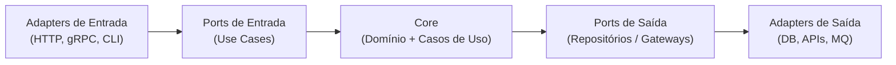

# Golang Hexagonal with Ports and Adapters

<p align="center">
  
</p>

## Hexagonal, o que é isso?

É uma forma de organizar o código em camadas, cada qual com a sua responsabilidade, tendo como objetivo isolar totalmente a lógica da aplicação do "externo". E assim é feito através de Ports e Adapters

Ports são interfaces que as camadas de baixo nível expõem

Adapters são as implementações para as interfaces em questão



### Adapters - Input

A camada de adapters é separada em duas partes, sendo uma delas a de input. Todos os tipos e formas de entrada de dados da sua aplicação têm de estar nesta camada, unificando assim em um adapter input

- **controllers/consumer/listener** são formas de entrada de dados que existem num adapter input
- **model para o modelo de entrada** para API, filas, etc. e assim separando:
  - model/request
  - model/response
- **mappers/converters que mapeiam o modelo** de request/response para o modelo de domínio (camada domain) e vice-versa
- **validations** pode ser a camada para que sejam criadas validações para objetos de entrada antes de serem convertidos para domain

### Adapters - Output

A outra parte da camada de adapters seria esta, a output. Todos os tipos de forma de saída de dados da aplicação têm que estar nesta camada, assim unificando

- **restClient/gRPCClient/producer/repository** são formas de saída de dados que existem num adapter output
- **model para o modelo de saída** para API, filas, entity de banco de dado e etc, e assim separando:
  - model/request
  - model/response
- **mappers/converters que mapeiam o modelo** de request/response para o modelo de domínio (camada domain) e vice-versa
- Além dos clients, podemos ter clientServices nos quais podem fazer algum enriquecimento de informações antes de chamar a camada externa

### Application

E temos a camada mais importante da aplicação. Nesta camada temos todas as regras de negócio em services e o mais importante: a camada domain, onde temos o objeto mais forte da aplicação inteira

- **Services** é a camada onde tudo será validado e criado na sua aplicação
- **useCases/Ports** é a camada onde você terá acesso às interfaces de entrada (usecases) e saída (ports)
- **Domain** identifica o objeto forte da sua aplicação, onde você terá todas as informações daquele fluxo no qual está sendo criado

### Configurations

Como toda aplicação, também devemos ter as configurações referentes a cada acesso externo, ambiente, feature-toggles, etc.

Para definir as configurações não existe um padrão de nomenclatura, mas claro, sempre bom o nome seguir a ideia de o que você está fazendo com aquela configuração, exemplo:

- Repository: adapter/output/database/mongodb  
  Configuration: database/mongodb
- HttpTestMS: adapter/output/http/testMs  
  Configuration: http/testMs

## Como rodar a aplicação

### Pré-requisitos

- Go 1.25.0+
- Docker
- Git

### Instalação

```bash
git clone https://github.com/gustavobarez/golang-architecture.git
cd golang-archictecture
cd hexagonal_ports_adapters
go mod download
```

### Configuracao de ambiente

Crie um `.env` na raiz do projeto (copie de `.env.example`):

```bash
cp .env.example .env
```

### Comandos Makefile

Abaixo têm os comandos do makefile. São comandos que orquestram o desenvolvimento local

- `make start` – Inicia toda a stack da aplicação (banco + migrations + geração de código + servidor)
- `make run` – Inicia apenas a aplicação Go (sem subir dependências)
- `make docker-run` – Inicia o docker (imagem postgres)
- `make docker-down` – Desliga o docker
- `make jet` – Gera os arquivos do JET
- `make migrate-up` – Inicia as migrations

## Ferramentas utilizadas

- [Go](https://go.dev/doc/) para desenvolvimento backend
- [Go-Jet](https://github.com/go-jet/jet) para geração de queries SQL type-safe
- [Docker](https://docs.docker.com/) para containerização
- [Uber Lib - Zap](https://github.com/uber-go/zap) para logging estruturado
